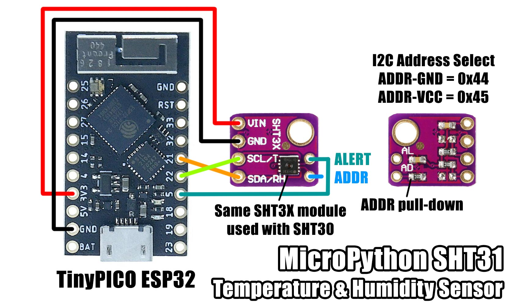

# MicroPython SHT31 Temperature and Humidity Sensor

A MicroPython library for the I2C Sensirion SHT3x series of temperature and relative humidity sensors.
This library has been tested with a SHT31 and SHT30 on the SHT3x module, but should also work with the SHT35.

## License

Licensed under the [MIT License](http://opensource.org/licenses/MIT).

Copyright (c) 2020 Mike Causer
